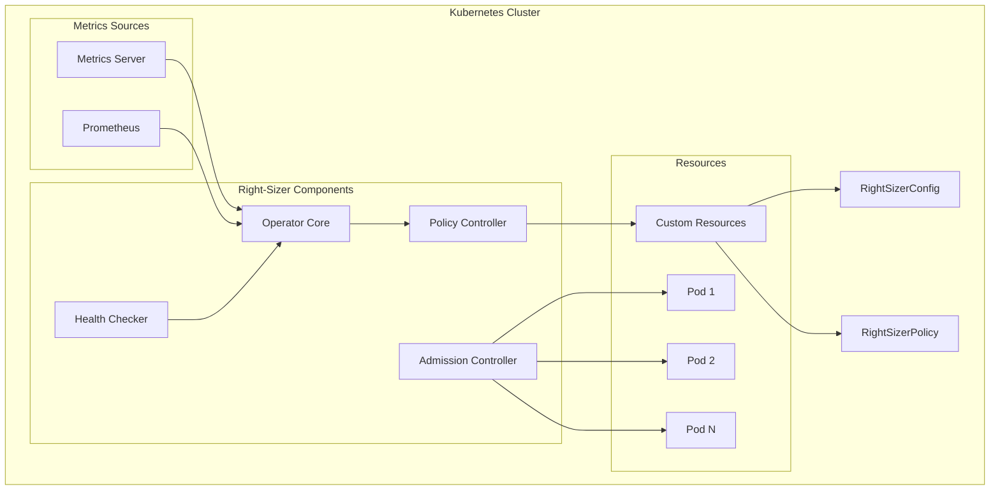
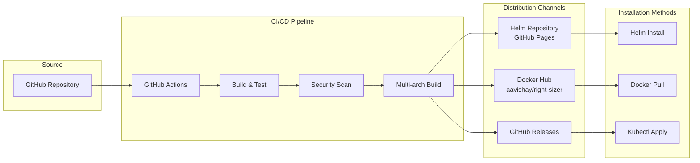
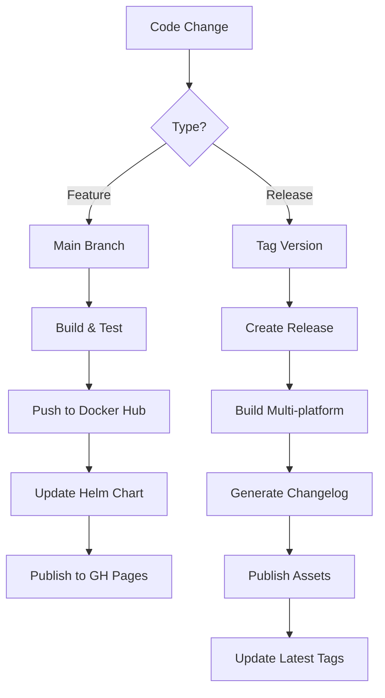

<div align="center">

# 🎯 Right-Sizer Operator

[](https://www.gnu.org/licenses/agpl-3.0)
[](https://github.com/aavishay/right-sizer/releases)
[](https://kubernetes.io)
[](https://golang.org)
[](https://helm.sh)
[](https://www.docker.com)

**Intelligent Kubernetes Resource Optimization with Zero Downtime**

[Documentation](./docs) | [Examples](./examples) | [Contributing](./docs/CONTRIBUTING.md) | [Troubleshooting](./docs/TROUBLESHOOTING.md)

</div>

---

## ⚡ TL;DR

Right-Sizer automatically adjusts Kubernetes pod resources based on actual usage, reducing costs and improving performance.

```bash
# Quick Install (Helm)
helm repo add right-sizer https://aavishay.github.io/right-sizer/charts
helm install right-sizer right-sizer/right-sizer --namespace right-sizer --create-namespace

# Quick Install (Docker)
docker pull aavishay/right-sizer:0.1.0  # Specific version
docker pull aavishay/right-sizer:latest # Latest version
```

**Key Benefits:** 🚀 Zero-downtime resizing • 💰 30-50% cost reduction • 🎯 Automatic optimization • 📊 Real-time monitoring

**Latest Fix:** ✅ Resolved issues with Guaranteed QoS pods - now correctly preserves QoS class during resource updates

---

## 📚 Table of Contents

- [Overview](#-overview)
- [Key Features](#-key-features)
- [Quick Start](#-quick-start)
- [Architecture](#-architecture)
- [Configuration](#-configuration)
- [Examples](#-examples)
- [Performance & Limitations](#-performance--limitations)
- [Monitoring & Observability](#-monitoring--observability)
- [FAQ](#-frequently-asked-questions)
- [Troubleshooting](#-troubleshooting)
- [Contributing](#-contributing)
- [Support](#-support)

---

## 📖 Overview

Right-Sizer is a Kubernetes operator that automatically optimizes pod resource allocations based on actual usage patterns. Using advanced algorithms and Kubernetes 1.33+ in-place resize capabilities, it ensures your applications have the resources they need while minimizing waste and reducing costs.

### 🎯 Is Right-Sizer Right for You?

✅ **Use Right-Sizer if you have:**
- Kubernetes 1.33+ clusters
- Variable workload patterns
- Cost optimization goals
- Need for automated resource management
- Over-provisioned or under-provisioned pods
- Difficulty determining optimal resource requests/limits

❌ **Consider alternatives if:**
- Running Kubernetes < 1.33
- Workloads with static, well-known resource requirements
- Strict compliance requirements preventing automatic changes
- Applications that can't tolerate any resource adjustments

### 📊 Typical Results

- **Cost Reduction**: 20-40% on cloud infrastructure
- **Resource Utilization**: Improved from 30% to 70%+
- **Performance**: 15% reduction in OOM kills
- **Operational**: 60% less manual intervention required

---

## ✨ Key Features

### 🚀 Core Functionality
- **In-Place Pod Resizing** (Kubernetes 1.33+): Zero-downtime resource adjustments - **right-sizer does not restart any pods**
- **Multiple Sizing Strategies**: Adaptive, conservative, aggressive, and custom modes
- **Multi-Source Metrics**: Supports Metrics Server and Prometheus
- **Intelligent Validation**: Respects node capacity, quotas, and limit ranges
- **Batch Processing**: Efficient handling of large-scale deployments

### 🧠 Policy & Intelligence
- **CRD-Based Configuration**: Native Kubernetes resource management
- **Priority-Based Policies**: Fine-grained control with selectors and priorities
- **Historical Analysis**: Learn from usage patterns over time
- **Predictive Scaling**: Anticipate resource needs based on trends
- **Safety Thresholds**: Configurable guardrails to prevent issues

### 🔒 Enterprise Security
- **Admission Controllers**: Validate and mutate resource requests
- **Comprehensive Audit Logging**: Complete audit trail for compliance
- **RBAC Integration**: Fine-grained permission control
- **Network Policies**: Secure network communication
- **Webhook Security**: TLS-secured admission webhooks

### 📊 Observability & Reliability
- **Prometheus Metrics**: Extensive operational metrics
- **Health Endpoints**: Comprehensive health monitoring
- **Circuit Breakers**: Automatic failure recovery
- **High Availability**: Multi-replica deployment support
- **Grafana Dashboards**: Pre-built visualization dashboards

---

## 🚀 Quick Start

### Prerequisites

| Component | Minimum | Recommended | Notes |
|-----------|---------|-------------|-------|
| Kubernetes | 1.33 | 1.33+ | Required for in-place resize |
| Helm | 3.0 | 3.12+ | For installation |
| Metrics | metrics-server 0.5 | 0.6+ | Or Prometheus |
| Memory | 2GB | 4GB+ | For Minikube/local |

### 1️⃣ Installation Options

#### Option A: Install from Helm Repository (Recommended)

```bash
# Add the official Helm repository
helm repo add right-sizer https://aavishay.github.io/right-sizer/charts
helm repo update

# Install with default configuration
helm install right-sizer right-sizer/right-sizer \
  --namespace right-sizer \
  --create-namespace

# Or install with custom values
helm install right-sizer right-sizer/right-sizer \
  --namespace right-sizer \
  --create-namespace \
  -f custom-values.yaml
```

#### Option B: Install from Source with Pre-built Images

```bash
# Clone the repository
git clone https://github.com/aavishay/right-sizer.git
cd right-sizer

# Install using Helm with Docker Hub images
helm install right-sizer ./helm \
  --namespace right-sizer \
  --create-namespace
```

#### Option C: Local Development with Custom Build

```bash
# Clone and build locally
git clone https://github.com/aavishay/right-sizer.git
cd right-sizer

# Build Docker image
docker build -t my-right-sizer:dev .

# For Minikube users
minikube start --kubernetes-version=v1.33.1 --memory=4096 --cpus=2
minikube image load my-right-sizer:dev

# Install with local image
helm install right-sizer ./helm \
  --namespace right-sizer \
  --create-namespace \
  --set image.repository=my-right-sizer \
  --set image.tag=dev \
  --set image.pullPolicy=Never
```

### 2️⃣ Available Versions

#### Helm Chart Versions
```bash
# View all available chart versions
helm search repo right-sizer --versions

# Install specific version
helm install right-sizer right-sizer/right-sizer --version 0.1.0
```

#### Docker Image Tags
- `latest` - Latest stable build from main branch
- `v{build-number}` - Specific build version (e.g., v123)
- `sha-{commit}` - Specific commit SHA
- `{version}` - Release versions (e.g., v1.0.0)

```bash
# Pull specific version
docker pull aavishay/right-sizer:latest
docker pull aavishay/right-sizer:v123
```

### 3️⃣ Configuration Management

#### View Default Values
```bash
# Show all configurable parameters
helm show values right-sizer/right-sizer > values.yaml

# Customize and install
vim values.yaml
helm install right-sizer right-sizer/right-sizer -f values.yaml
```

#### Quick Configuration Profiles
```bash
# Development - Aggressive optimization
helm install right-sizer right-sizer/right-sizer \
  --set defaultConfig.mode=aggressive \
  --set defaultConfig.resizeInterval=30s

# Production - Conservative with dry-run
helm install right-sizer right-sizer/right-sizer \
  --set defaultConfig.mode=conservative \
  --set defaultConfig.dryRun=true \
  --set defaultConfig.constraints.cooldownPeriod=10m

# Cost Optimization Focus
helm install right-sizer right-sizer/right-sizer \
  --set defaultConfig.mode=cost-optimized \
  --set defaultConfig.constraints.maxChangePercentage=30
```

### 4️⃣ Post-Installation

#### Verify Installation
```bash
# Check operator status
kubectl get pods -n right-sizer
kubectl logs -n right-sizer -l app.kubernetes.io/name=right-sizer

# View created resources
kubectl get rightsizerpolicies -A
kubectl get rightsizerconfigs -A
```

#### Apply Custom Policies
```bash
# Development environment
kubectl apply -f examples/config-global-settings.yaml
kubectl apply -f examples/policies-workload-types.yaml

# Production environment
kubectl apply -f examples/config-conservative.yaml

# Cost optimization
kubectl apply -f examples/config-scaling-thresholds.yaml
```

#### Upgrade or Uninstall
```bash
# Upgrade to latest version
helm repo update
helm upgrade right-sizer right-sizer/right-sizer

# Uninstall
helm uninstall right-sizer -n right-sizer
kubectl delete namespace right-sizer
```

### 5️⃣ Verify Right-Sizer Operation

```bash
# Check operator status
kubectl get pods -n right-sizer

# View operator logs
kubectl logs -n right-sizer -l app=right-sizer -f

# Check CRDs
kubectl get rightsizerconfigs
kubectl get rightsizerpolicies

# Test health endpoints
kubectl port-forward -n right-sizer svc/right-sizer 8081:8081
curl http://localhost:8081/healthz
curl http://localhost:8081/readyz
```

---

## 🏗️ Architecture



### Component Overview

| Component | Purpose | Key Features |
|-----------|---------|--------------|
| **Operator Core** | Main control loop | Resource monitoring, decision making |
| **Policy Controller** | Policy management | Priority evaluation, rule matching |
| **Admission Controller** | Request validation | Webhook validation, mutation |
| **Health Checker** | Health monitoring | Liveness, readiness probes |
| **Metrics Collector** | Data gathering | Multi-source metrics aggregation |

---

## 🚢 Deployment & Distribution

### Deployment Architecture

Right-Sizer is distributed through multiple channels for maximum accessibility:



### Distribution Channels

| Channel | URL | Purpose | Update Frequency |
|---------|-----|---------|------------------|
| **Helm Repository** | https://aavishay.github.io/right-sizer/charts | Official Helm charts | On every helm/ change |
| **Docker Hub** | docker.io/aavishay/right-sizer | Container images | On every main push |
| **GitHub Releases** | github.com/aavishay/right-sizer/releases | Binary releases & archives | On version tags |
| **Source Code** | github.com/aavishay/right-sizer | Development & customization | Continuous |

### CI/CD Pipeline

The project uses GitHub Actions for automated building, testing, and deployment:

#### Automated Workflows

1. **Docker Build & Push** (`docker-build.yml`)
   - Triggers: Push to main, PRs, tags
   - Multi-architecture builds (amd64, arm64)
   - Automated security scanning with Trivy
   - SBOM generation
   - Push to Docker Hub with tags:
     - `latest` (main branch)
     - `v{build-number}`
     - `sha-{commit}`

2. **Helm Chart Publishing** (`helm-publish.yml`)
   - Triggers: Changes to helm/, releases, manual
   - Packages Helm charts
   - Publishes to GitHub Pages
   - Maintains version history
   - Generates repository index

3. **Release Pipeline** (`release.yml`)
   - Triggers: Version tags (v*.*.*)
   - Creates GitHub releases
   - Builds binaries for multiple platforms
   - Generates changelog
   - Updates Docker tags

#### Build Matrix

| Platform | Architecture | Base Image | Size |
|----------|-------------|------------|------|
| Linux | amd64 | Alpine 3.20 | ~50MB |
| Linux | arm64 | Alpine 3.20 | ~50MB |
| Darwin | amd64 | Binary only | ~35MB |
| Darwin | arm64 | Binary only | ~35MB |
| Windows | amd64 | Binary only | ~35MB |

### Installation Methods Comparison

| Method | Pros | Cons | Best For |
|--------|------|------|----------|
| **Helm Repository** | Version management, Standard workflow, Easy upgrades | Requires Helm | Production deployments |
| **Docker Hub** | Pre-built images, Multi-arch support | Manual manifest management | Quick testing, CI/CD |
| **Source Build** | Full customization, Latest features | Requires build tools | Development, customization |
| **GitHub Releases** | Direct binary access, Checksums provided | Manual installation | Air-gapped environments |

### Release Process



### Quick Deployment Commands

```bash
# Production Deployment (Helm)
helm repo add right-sizer https://aavishay.github.io/right-sizer/charts
helm repo update
helm install right-sizer right-sizer/right-sizer \
  --namespace right-sizer \
  --create-namespace \
  --version 0.1.0

# Development Deployment (Latest)
docker pull aavishay/right-sizer:latest
helm install right-sizer right-sizer/right-sizer \
  --set image.tag=latest

# GitOps/ArgoCD Integration
cat <<EOF | kubectl apply -f -
apiVersion: argoproj.io/v1alpha1
kind: Application
metadata:
  name: right-sizer
spec:
  source:
    repoURL: https://aavishay.github.io/right-sizer/charts
    chart: right-sizer
    targetRevision: 0.1.0
  destination:
    server: https://kubernetes.default.svc
    namespace: right-sizer
EOF
```

---

## ⚙️ Configuration

### CRD-Based Configuration

Right-Sizer uses two primary Custom Resource Definitions:

#### RightSizerConfig (Global Settings)

```yaml
apiVersion: rightsizer.io/v1alpha1
kind: RightSizerConfig
metadata:
  name: default
spec:
  enabled: true
  defaultMode: balanced  # aggressive | balanced | conservative | custom
  resizeInterval: "30s"
  dryRun: false

  defaultResourceStrategy:
    cpu:
      requestMultiplier: 1.2
      limitMultiplier: 2.0
      minRequest: 10m
      maxLimit: 4000m
      scaleUpThreshold: 0.8
      scaleDownThreshold: 0.3
    memory:
      requestMultiplier: 1.2
      limitMultiplier: 1.5
      minRequest: 128Mi
      maxLimit: 8Gi
      scaleUpThreshold: 0.8
      scaleDownThreshold: 0.3

  globalConstraints:
    maxChangePercentage: 50
    cooldownPeriod: "5m"
    maxConcurrentResizes: 10
    respectPDB: true
    respectHPA: true
```

#### RightSizerPolicy (Workload-Specific Rules)

```yaml
apiVersion: rightsizer.io/v1alpha1
kind: RightSizerPolicy
metadata:
  name: production-critical
spec:
  enabled: true
  priority: 100
  mode: conservative

  targetRef:
    kind: Deployment
    namespaces: ["production"]
    labelSelector:
      matchLabels:
        tier: critical

  resourceStrategy:
    cpu:
      requestMultiplier: 1.5
      limitMultiplier: 3.0
      targetUtilization: 60
    memory:
      requestMultiplier: 1.3
      limitMultiplier: 2.0
      targetUtilization: 70

  constraints:
    maxChangePercentage: 25
    cooldownPeriod: "30m"
```

### Configuration Modes

| Mode | CPU Buffer | Memory Buffer | Change Frequency | Use Case |
|------|------------|---------------|------------------|----------|
| **Aggressive** | 10% | 10% | Every 30s | Development, testing |
| **Balanced** | 20% | 20% | Every 1m | General workloads |
| **Conservative** | 50% | 30% | Every 5m | Production critical |
| **Custom** | User-defined | User-defined | User-defined | Special requirements |

---

## 📁 Examples

### Available Example Configurations

| File | Description | Use Case |
|------|-------------|----------|
| `config-global-settings.yaml` | Global operator configuration | Initial setup |
| `config-namespace-filtering.yaml` | Namespace inclusion/exclusion | Multi-tenant clusters |
| `config-rate-limiting.yaml` | Rate limiting settings | Large clusters |
| `config-scaling-thresholds.yaml` | Custom scaling thresholds | Fine-tuning |
| `policies-workload-types.yaml` | Various workload policies | Different app types |
| `helm-values-custom.yaml` | Helm customization | Deployment options |

### Quick Examples

#### Enable for Specific Namespace
```yaml
apiVersion: rightsizer.io/v1alpha1
kind: RightSizerConfig
metadata:
  name: namespace-specific
spec:
  namespaceConfig:
    includeNamespaces: ["production", "staging"]
    excludeNamespaces: ["kube-system", "kube-public"]
```

#### Aggressive Development Settings
```yaml
apiVersion: rightsizer.io/v1alpha1
kind: RightSizerPolicy
metadata:
  name: dev-aggressive
spec:
  mode: aggressive
  targetRef:
    namespaces: ["development"]
  resourceStrategy:
    cpu:
      requestMultiplier: 1.05
      targetUtilization: 80
    memory:
      requestMultiplier: 1.05
      targetUtilization: 85
```

---

## ⚡ Performance & Limitations

### Performance Characteristics

| Metric | Value | Notes |
|--------|-------|-------|
| **Pod Processing Rate** | 1000/minute | Configurable batch size |
| **CPU Overhead** | <50m | Operator resource usage |
| **Memory Footprint** | ~128Mi base | Scales with pod count |
| **Metrics Interval** | 30s default | Configurable |
| **Decision Latency** | <100ms | Per pod calculation |
| **Startup Time** | <30s | Time to operational |

### Current Limitations

| Limitation | Description | Workaround |
|------------|-------------|------------|
| **K8s Version** | Requires 1.33+ for in-place resize | No workaround - operator requires K8s 1.33+ |
| **Init Containers** | Not supported | Exclude pods with init containers |
| **Ephemeral Containers** | Not supported | Exclude debug pods |
| **Max Concurrent** | 10 resize operations | Increase in config if needed |
| **Metrics Delay** | 2-3 minute initial delay | Wait for metrics to populate |

---

## 📊 Monitoring & Observability

### Health Endpoints

| Endpoint | Purpose | Response |
|----------|---------|----------|
| `/healthz` | Liveness probe | HTTP 200 if alive |
| `/readyz` | Readiness probe | HTTP 200 if ready |
| `/readyz/detailed` | Detailed health | JSON component status |
| `/metrics` | Prometheus metrics | Prometheus format |

### Key Metrics

```prometheus
# Resource adjustments
rightsizer_adjustments_total{namespace, type}
rightsizer_adjustment_size_bytes{namespace, resource}

# Operational metrics
rightsizer_pods_monitored{namespace}
rightsizer_policies_active{}
rightsizer_resize_duration_seconds{}

# Error tracking
rightsizer_errors_total{type}
rightsizer_resize_failures_total{reason}
```

### Grafana Dashboard

Import the provided dashboard for visualization:
```bash
kubectl create configmap grafana-dashboard \
  --from-file=docs/grafana/dashboard.json \
  -n monitoring
```

---

## ❓ Frequently Asked Questions

### General Questions

**Q: Will Right-Sizer cause downtime?**
A: With Kubernetes 1.33+, CPU adjustments use in-place resizing without downtime.

**Q: How does it differ from VPA (Vertical Pod Autoscaler)?**
A: Right-Sizer offers more control, custom policies, better production safety features, and works alongside HPA. It's designed for production use with extensive safety mechanisms.

**Q: Can I exclude certain pods?**
A: Yes, use namespace exclusions, pod annotations (`right-sizer.io/exclude: "true"`), or label selectors in policies.

**Q: What metrics providers are supported?**
A: Metrics Server and Prometheus are fully supported. Custom providers can be integrated via the metrics interface.

**Q: How quickly does it react to load changes?**
A: By default, it evaluates every 30 seconds with a 5-minute cooldown between changes. This is configurable.

### Technical Questions

**Q: Does it work with HPA (Horizontal Pod Autoscaler)?**
A: Yes, Right-Sizer adjusts vertical resources while HPA handles horizontal scaling. They complement each other.

**Q: What happens during operator downtime?**
A: Existing pod resources remain unchanged. The operator resumes monitoring when it starts again.

**Q: Can it handle stateful workloads?**
A: Yes, with appropriate policies.

**Q: Is there a rollback mechanism?**
A: Yes, you can enable dry-run mode, use audit logs to track changes, and manually revert if needed.

---

## 🔍 Troubleshooting

### Quick Troubleshooting Guide

| Problem | Solution | Check Command |
|---------|----------|---------------|
| **Pods not resizing** | Check operator logs | `kubectl logs -n right-sizer -l app=right-sizer` |
| **Permission errors** | Update RBAC | `kubectl apply -f helm/templates/rbac.yaml` |
| **Metrics missing** | Verify metrics server | `kubectl top pods` |
| **High CPU usage** | Increase resize interval | Update `resizeInterval` in config |
| **Webhook errors** | Check certificates | `kubectl get validatingwebhookconfigurations` |
| **CRD errors** | Reinstall CRDs | `kubectl apply -f helm/crds/` |

### Common Issues and Solutions

#### 1. "Unknown field" errors in logs
```bash
# Update CRDs to latest version
kubectl apply -f helm/crds/
```

#### 2. Metrics not available
```bash
# Install metrics-server
kubectl apply -f https://github.com/kubernetes-sigs/metrics-server/releases/latest/download/components.yaml
```

#### 3. Too many resize operations
```yaml
spec:
  globalConstraints:
    maxConcurrentResizes: 5  # Reduce concurrent operations
    cooldownPeriod: "15m"   # Increase cooldown between resizes
```

### Debug Commands

```bash
# View recent events
kubectl get events -n right-sizer --sort-by='.lastTimestamp'

# Check operator status
kubectl describe deployment right-sizer -n right-sizer

# View applied configurations
kubectl get rightsizerconfigs -o yaml
kubectl get rightsizerpolicies -o yaml

# Test metrics availability
kubectl top nodes
kubectl top pods -A

# Check webhook configuration
kubectl get validatingwebhookconfigurations
kubectl get mutatingwebhookconfigurations
```

---

## 🛠️ Development

### Prerequisites

- Go 1.25+
- Docker
- Kubernetes 1.33+ (Minikube recommended)
- Make
- Helm 3.0+

### Local Development Setup

```bash
# Clone repository
git clone https://github.com/right-sizer/right-sizer.git
cd right-sizer

# Start Minikube
minikube start --kubernetes-version=v1.33.1 --memory=4096 --cpus=2

# Build and test
make build
make test
make docker-build

# Deploy locally
make deploy

# Watch logs
kubectl logs -f deployment/right-sizer -n right-sizer

# Run integration tests
./tests/test-suite-all.sh
```

### Project Structure

```
right-sizer/
├── go/                      # Go source code
│   ├── api/v1alpha1/       # CRD API definitions
│   ├── controllers/        # Kubernetes controllers
│   ├── admission/          # Admission webhooks
│   ├── metrics/           # Metrics collection
│   ├── policy/            # Policy engine
│   └── main.go           # Entry point
├── helm/                   # Helm chart
│   ├── crds/             # CRD definitions
│   ├── templates/        # Kubernetes manifests
│   └── values.yaml      # Default values
├── examples/              # Example configurations
├── docs/                 # Documentation
├── tests/                # Test suites
└── scripts/              # Utility scripts
```

---

## 🤝 Contributing

We welcome contributions! Please see [CONTRIBUTING.md](docs/CONTRIBUTING.md) for:

- Code of conduct
- Development process
- Submitting pull requests
- Reporting issues
- Feature requests

### Quick Contribution Guide

1. Fork the repository
2. Create a feature branch (`git checkout -b feature/amazing-feature`)
3. Commit changes (`git commit -m 'Add amazing feature'`)
4. Push to branch (`git push origin feature/amazing-feature`)
5. Open a Pull Request

---

## 📜 License

This project is licensed under the **GNU Affero General Public License v3.0 (AGPL-3.0)**. See [LICENSE](LICENSE) for details.

### License Summary

- ✅ Commercial use
- ✅ Distribution
- ✅ Modification
- ✅ Private use
- ⚠️ Disclose source
- ⚠️ Same license
- ⚠️ State changes

---

## 🆘 Support

### Community Support

- 💬 [GitHub Discussions](https://github.com/right-sizer/right-sizer/discussions) - Ask questions, share ideas
- 🐛 [GitHub Issues](https://github.com/right-sizer/right-sizer/issues) - Report bugs, request features
- 📖 [Documentation](./docs) - Comprehensive guides and references
- 💡 [Examples](./examples) - Sample configurations and use cases

<!--### Commercial Support

- 📧 Email: support@right-sizer.io
- 🎫 Enterprise support plans available
- 🏢 Professional services for implementation

### Security

Report security vulnerabilities to: security@right-sizer.io-->

---

## 🌟 Star History

If you find Right-Sizer useful, please consider giving us a star ⭐ on GitHub!

---

<div align="center">
Made with ❤️ by the Right-Sizer Community
</div>
