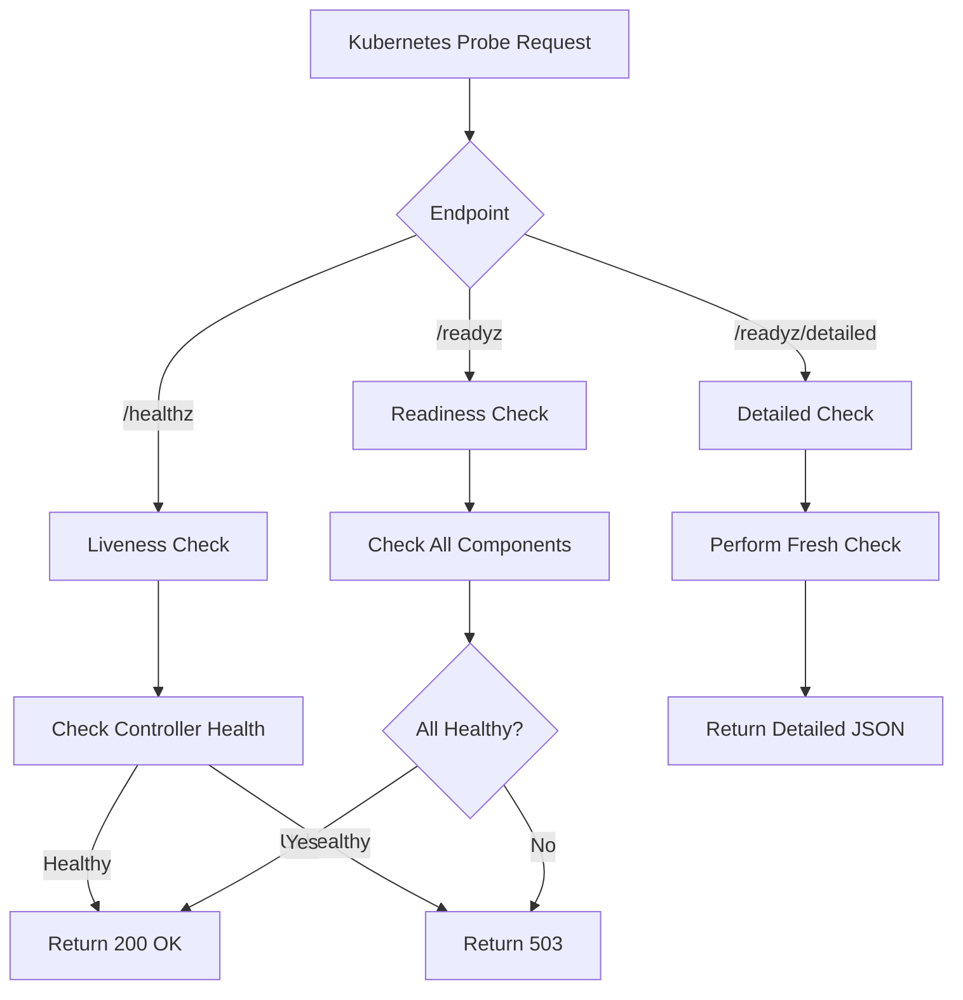

# Health Checks Documentation

## Overview

The Right-Sizer operator implements a comprehensive health check system to ensure reliable operation and proper integration with Kubernetes health probes. The system monitors multiple components and provides detailed health status information.

## Health Check Architecture

The health check system consists of:

1. **Health Checker Component** (`health/checker.go`)
   - Monitors individual operator components
   - Performs periodic health checks
   - Maintains component health status

2. **Health Endpoints** (exposed on port 8081)
   - `/healthz` - Liveness probe endpoint
   - `/readyz` - Readiness probe endpoint
   - `/readyz/detailed` - Detailed health status

3. **Component Monitoring**
   - Controller status
   - Metrics provider health
   - Webhook server health (if enabled)

## Health Endpoints

### Liveness Probe (`/healthz`)

The liveness probe checks if the operator is alive and should not be restarted.

- **Port**: 8081
- **Path**: `/healthz`
- **Success Criteria**: Controller component is healthy
- **Purpose**: Detect if the operator needs to be restarted

```yaml
livenessProbe:
  httpGet:
    path: /healthz
    port: 8081
  initialDelaySeconds: 15
  periodSeconds: 20
```

### Readiness Probe (`/readyz`)

The readiness probe checks if the operator is ready to serve traffic.

- **Port**: 8081
- **Path**: `/readyz`
- **Success Criteria**: All critical components are healthy
- **Purpose**: Determine if the operator can handle requests

```yaml
readinessProbe:
  httpGet:
    path: /readyz
    port: 8081
  initialDelaySeconds: 5
  periodSeconds: 10
```

### Detailed Health Status (`/readyz/detailed`)

Provides comprehensive health information about all components.

- **Port**: 8081
- **Path**: `/readyz/detailed`
- **Response**: Detailed JSON with component status
- **Purpose**: Debugging and monitoring

## Component Health Monitoring

### Controller Component

- **Always Monitored**: Yes
- **Health Criteria**: Process is running and responding
- **Impact**: Critical - affects liveness probe

### Metrics Provider

- **Always Monitored**: When initialized
- **Health Criteria**: 
  - Provider is initialized
  - Can connect to metrics source
- **Impact**: Affects readiness probe
- **States**:
  - `Not initialized` - Provider not yet configured
  - `Healthy` - Provider working correctly
  - `Unhealthy` - Connection or query issues

### Webhook Server

- **Always Monitored**: When enabled
- **Health Criteria**:
  - Server is running
  - TLS certificates are valid
  - Can handle requests
- **Impact**: Affects readiness probe when enabled
- **States**:
  - `Not enabled` - Webhook disabled in configuration
  - `Starting` - Webhook initialization in progress
  - `Healthy` - Webhook operational
  - `Unhealthy` - Server issues

## Health Check Configuration

The health check system is automatically configured with sensible defaults:

```go
// Health probe configuration in manager
HealthProbeBindAddress: ":8081"

// Periodic health check interval
checkInterval: 30 * time.Second

// Component staleness threshold
staleThreshold: 5 * time.Minute
```

## Testing Health Endpoints

### Using the Test Script

A test script is provided to verify health endpoints:

```bash
# Run health check tests
./tests/scripts/test-health.sh

# Specify custom namespace
NAMESPACE=my-namespace ./tests/scripts/test-health.sh

# Specify custom deployment name
DEPLOYMENT_NAME=my-right-sizer ./tests/scripts/test-health.sh
```

### Manual Testing

#### Check Liveness

```bash
# Port-forward to the operator pod
kubectl port-forward -n default pod/right-sizer-xxx 8081:8081

# Test liveness endpoint
curl http://localhost:8081/healthz
```

#### Check Readiness

```bash
# Test readiness endpoint
curl http://localhost:8081/readyz

# Get detailed status
curl http://localhost:8081/readyz/detailed
```

### Using kubectl

```bash
# Check pod status
kubectl get pods -n default -l app=right-sizer

# Describe pod for probe status
kubectl describe pod right-sizer-xxx -n default

# Check events
kubectl get events -n default --field-selector involvedObject.name=right-sizer-xxx
```

## Troubleshooting

### Pod Not Becoming Ready

1. **Check readiness probe status**:
   ```bash
   kubectl describe pod right-sizer-xxx -n default | grep -A5 "Readiness"
   ```

2. **Check component health**:
   ```bash
   curl http://localhost:8081/readyz/detailed
   ```

3. **Review logs**:
   ```bash
   kubectl logs right-sizer-xxx -n default | grep -i "health"
   ```

### Liveness Probe Failures

1. **Check if controller is running**:
   ```bash
   kubectl logs right-sizer-xxx -n default | grep "Controller"
   ```

2. **Check for panic or fatal errors**:
   ```bash
   kubectl logs right-sizer-xxx -n default | grep -E "panic|fatal|error"
   ```

### Component Health Issues

#### Metrics Provider Unhealthy

- Verify metrics-server is installed:
  ```bash
  kubectl get deployment metrics-server -n kube-system
  ```

- Check metrics API availability:
  ```bash
  kubectl top nodes
  ```

- If using Prometheus, verify endpoint connectivity:
  ```bash
  curl http://prometheus-endpoint:9090/api/v1/query
  ```

#### Webhook Server Unhealthy

- Check if webhook is enabled in configuration:
  ```bash
  kubectl get rightsizerconfig -o yaml
  ```

- Verify TLS certificates:
  ```bash
  kubectl get secret right-sizer-webhook-certs -n default
  ```

- Check webhook service:
  ```bash
  kubectl get svc right-sizer-webhook -n default
  ```

## Health Status in CRD

The RightSizerConfig CRD status includes system health information:

```yaml
status:
  systemHealth:
    metricsProviderHealthy: true
    webhookHealthy: true
    leaderElectionActive: false
    isLeader: true
    lastHealthCheck: "2024-01-15T10:30:00Z"
    errors: 0
    warnings: 0
```

Check health status:
```bash
kubectl get rightsizerconfig default-config -o jsonpath='{.status.systemHealth}' | jq
```

## Monitoring Integration

### Prometheus Metrics

Health status is exposed as Prometheus metrics:

```prometheus
# Component health status (1 = healthy, 0 = unhealthy)
rightsizer_component_health{component="controller"} 1
rightsizer_component_health{component="metrics_provider"} 1
rightsizer_component_health{component="webhook"} 0

# Health check duration
rightsizer_health_check_duration_seconds{component="controller"} 0.001
```

### Grafana Dashboard

A Grafana dashboard can visualize health status:
- Component health over time
- Health check latency
- Probe failure rate
- Component availability percentage

## Best Practices

1. **Set Appropriate Probe Timings**
   - Liveness: Higher threshold to avoid unnecessary restarts
   - Readiness: Lower threshold for quick detection

2. **Monitor Health Metrics**
   - Set up alerts for prolonged unhealthy states
   - Track health check latency trends

3. **Regular Health Verification**
   - Periodically run the test script
   - Monitor component logs for health issues

4. **Component Dependencies**
   - Ensure metrics-server is healthy before enabling
   - Verify webhook certificates before enabling admission control

## Health Check Flow



## Related Documentation

- [Configuration Guide](../CONFIGURATION.md)
- [Troubleshooting Guide](./TROUBLESHOOTING.md)
- [Monitoring Guide](./MONITORING.md)
- [Deployment Guide](./DEPLOYMENT.md)