# 📦 OCI Helm Registry Support

This document explains how the Right-Sizer project publishes Helm charts to OCI (Open Container Initiative) registries.

## 🎯 Overview

Right-Sizer publishes Helm charts to **both** traditional Helm repositories and modern OCI registries:

- **Traditional Repository**: `https://aavishay.github.io/right-sizer/charts` (GitHub Pages)
- **OCI Registry**: `oci://registry-1.docker.io/aavishay/right-sizer` (Docker Hub)

## 🚀 Installation Methods

### Option 1: OCI Registry (Recommended)

The modern approach using OCI registries:

```bash
# Install directly from OCI registry
helm install right-sizer oci://registry-1.docker.io/aavishay/right-sizer \
  --version 0.1.7 \
  --namespace right-sizer \
  --create-namespace

# Install with custom values
helm install right-sizer oci://registry-1.docker.io/aavishay/right-sizer \
  --version 0.1.7 \
  --namespace right-sizer \
  --create-namespace \
  -f custom-values.yaml
```

### Option 2: Traditional Helm Repository

The classic approach:

```bash
# Add repository
helm repo add right-sizer https://aavishay.github.io/right-sizer/charts
helm repo update

# Install chart
helm install right-sizer right-sizer/right-sizer \
  --version 0.1.7 \
  --namespace right-sizer \
  --create-namespace
```

## 🔄 CI/CD Publishing Process

### Automatic Publishing

Both publishing methods are automated via GitHub Actions:

1. **On Git Tag**: When a version tag is pushed (e.g., `v0.1.7`)
2. **On Release**: When a GitHub release is created
3. **On Helm Changes**: When files in `helm/` directory are modified

### Publishing Workflow

```mermaid
graph LR
    A[Git Tag] --> B[Release Workflow]
    B --> C[Package Chart]
    C --> D[Push to OCI]
    C --> E[Push to GitHub Pages]
    D --> F[✅ OCI Available]
    E --> G[✅ Traditional Available]
```



### Workflow Files

| Workflow | Triggers | OCI Support | GitHub Pages |
|----------|----------|-------------|--------------|
| `release.yml` | Git tags | ✅ Added | ❌ No |
| `helm-publish.yml` | Helm changes, releases | ✅ Added | ✅ Yes |

## 🛠️ Technical Implementation

### OCI Authentication

Both workflows authenticate to Docker Hub using secrets:

```yaml
- name: Log in to Docker Hub for OCI
  uses: docker/login-action@v3
  with:
    registry: registry-1.docker.io
    username: ${{ secrets.DOCKER_USERNAME }}
    password: ${{ secrets.DOCKER_PASSWORD }}
```

### Chart Publishing

```yaml
- name: Push Helm chart to OCI registry
  run: |
    VERSION="${{ steps.chart_version.outputs.VERSION }}"
    CHART_FILE=$(ls right-sizer-${VERSION}.tgz)
    
    helm push "$CHART_FILE" oci://registry-1.docker.io/aavishay
    
    echo "✅ Published oci://registry-1.docker.io/aavishay/right-sizer:${VERSION}"
```

## 🔍 Verification

### Check Available Versions

```bash
# OCI registry (requires Helm 3.8+)
helm show chart oci://registry-1.docker.io/aavishay/right-sizer --version 0.1.7

# Traditional repository
helm repo add right-sizer https://aavishay.github.io/right-sizer/charts
helm search repo right-sizer --versions
```

### Registry Status

You can verify both registries are available:

| Registry Type | URL | Status Check |
|---------------|-----|--------------|
| **OCI** | `registry-1.docker.io/aavishay/right-sizer` | `helm show chart oci://registry-1.docker.io/aavishay/right-sizer` |
| **Traditional** | `aavishay.github.io/right-sizer/charts` | `curl https://aavishay.github.io/right-sizer/charts/index.yaml` |

## 📋 Requirements

### Helm Version Requirements

| Feature | Minimum Helm Version |
|---------|---------------------|
| OCI Registry Support | 3.8.0+ |
| `helm push` command | 3.8.0+ |
| Traditional repositories | 2.0.0+ |

### Runtime Requirements

```bash
# Check Helm version
helm version

# Ensure OCI support is enabled
helm env | grep HELM_EXPERIMENTAL_OCI
```

## 🚨 Troubleshooting

### Common Issues

#### 1. OCI Authentication Failed
```bash
# Error: failed to authorize: authentication required
# Solution: Verify Docker Hub credentials
helm registry login registry-1.docker.io -u username
```

#### 2. Chart Not Found in OCI Registry
```bash
# Error: chart not found
# Solution: Check version exists
helm show chart oci://registry-1.docker.io/aavishay/right-sizer --version latest
```

#### 3. Helm Version Too Old
```bash
# Error: unknown command "push" for "helm"
# Solution: Upgrade Helm to 3.8+
brew upgrade helm  # macOS
```

### Debug Commands

```bash
# List available charts in OCI registry
helm show chart oci://registry-1.docker.io/aavishay/right-sizer

# Verify traditional repository
curl -s https://aavishay.github.io/right-sizer/charts/index.yaml | grep version

# Check Helm configuration
helm env
```

## 🔄 Migration from Traditional to OCI

### For End Users

```bash
# Old method
helm repo add right-sizer https://aavishay.github.io/right-sizer/charts
helm install right-sizer right-sizer/right-sizer

# New method (recommended)
helm install right-sizer oci://registry-1.docker.io/aavishay/right-sizer --version 0.1.7
```

### Benefits of OCI

| Aspect | Traditional Helm Repo | OCI Registry |
|--------|---------------------|--------------|
| **Authentication** | Basic/None | Docker registry auth |
| **Versioning** | Repository index | Container tags |
| **Storage** | Static files | OCI artifacts |
| **Bandwidth** | Full index download | On-demand |
| **Caching** | Limited | Docker layer caching |
| **Security** | HTTPS only | OCI security model |

## 🔗 Related Links

- [Helm OCI Support](https://helm.sh/docs/topics/registries/)
- [Docker Hub OCI Artifacts](https://docs.docker.com/docker-hub/oci-artifacts/)
- [Right-Sizer Docker Hub](https://hub.docker.com/r/aavishay/right-sizer)
- [GitHub Actions Workflows](../.github/workflows/)