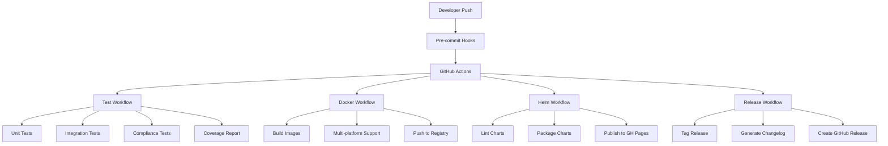

# Right-Sizer CI Testing Guide

## Table of Contents
- [Overview](#overview)
- [CI/CD Architecture](#cicd-architecture)
- [Test Categories](#test-categories)
- [GitHub Actions Workflows](#github-actions-workflows)
- [Local Testing](#local-testing)
- [Pre-Commit Hooks](#pre-commit-hooks)
- [Test Coverage](#test-coverage)
- [Integration Testing](#integration-testing)
- [Performance Testing](#performance-testing)
- [Security Testing](#security-testing)
- [Troubleshooting](#troubleshooting)
- [Best Practices](#best-practices)

## Overview

The Right-Sizer project implements a comprehensive CI/CD pipeline that ensures code quality, reliability, and security through multiple layers of automated testing. This guide covers all aspects of testing in the CI pipeline, from unit tests to integration tests, performance benchmarks, and security scans.

### Key Features
- ✅ Automated unit and integration testing
- ✅ Multi-platform Docker image builds
- ✅ Helm chart validation and publishing
- ✅ Coverage reporting with thresholds
- ✅ Security vulnerability scanning
- ✅ Pre-commit hooks for early detection
- ✅ Kubernetes compliance testing
- ✅ Performance benchmarking

## CI/CD Architecture



## Test Categories

### 1. Unit Tests
Tests individual components in isolation.

**Location**: `go/**/*_test.go`

**Coverage Areas**:
- Controllers (resize logic, policy enforcement)
- Metrics collection and calculation
- Configuration management
- Validation logic
- API server endpoints
- Webhook admission control

### 2. Integration Tests
Tests component interactions with external systems.

**Location**: `tests/integration/`

**Coverage Areas**:
- Kubernetes API interactions
- Prometheus metrics integration
- Policy engine workflow
- End-to-end resize operations

### 3. Compliance Tests
Validates Kubernetes specification compliance.

**Location**: `tests/integration/k8s_*_test.go`

**Coverage Areas**:
- In-place resize API compliance
- Resource QoS guarantees
- ResizePolicy implementation
- Status conditions handling

### 4. E2E Tests
Full system tests in real Kubernetes environments.

**Location**: `tests/e2e-real/`

**Coverage Areas**:
- Minikube deployment testing
- Real workload scenarios
- Multi-namespace operations
- RBAC permissions validation

## GitHub Actions Workflows

### Test Workflow (`.github/workflows/test.yml`)

**Trigger**: Push to main, manual dispatch

**Steps**:
1. **Environment Setup**
   - Go 1.25 installation
   - Version and build date extraction
   - Environment verification

2. **Testing**
   ```yaml
   - name: Run Go tests
     run: |
       cd go
       go test -v ./...
   ```

3. **Binary Build**
   ```yaml
   - name: Build Go binary
     run: |
       cd go
       go build -o ../right-sizer-test main.go
   ```

4. **Helm Validation**
   ```yaml
   - name: Verify Helm chart
     run: |
       helm lint helm/
   ```

### Docker Workflow (`.github/workflows/docker.yml`)

**Trigger**: Push to main, manual dispatch

**Features**:
- Multi-platform builds (amd64, arm64)
- BuildKit caching
- Automated version tagging
- Image verification

**Key Configuration**:
```yaml
platforms: linux/amd64,linux/arm64
cache-from: type=gha
cache-to: type=gha,mode=max
```

### Helm Workflow (`.github/workflows/helm.yml`)

**Trigger**: Push to main, manual dispatch

**Process**:
1. Lint Helm charts
2. Template validation
3. Package charts
4. Publish to GitHub Pages
5. Update repository index

## Local Testing

### Quick Test Commands

```bash
# Run all unit tests
make test

# Run with coverage
make test-coverage

# Run integration tests
make test-integration

# Run all tests (unit + integration + compliance)
make test-all

# Run specific test categories
make test-k8s-compliance
make test-resize-policy
make test-qos-validation
make test-inplace-resize
```

### Advanced Testing Script

The `tests/run-all-tests.sh` script provides comprehensive testing:

```bash
# Basic usage
./tests/run-all-tests.sh

# With coverage
./tests/run-all-tests.sh --coverage

# Verbose output
./tests/run-all-tests.sh --verbose

# Integration tests included
./tests/run-all-tests.sh --integration

# Benchmarks
./tests/run-all-tests.sh --benchmark

# Combined
./tests/run-all-tests.sh -c -v -i -b
```

**Options**:
- `-c, --coverage`: Enable coverage reporting
- `-v, --verbose`: Verbose test output
- `-i, --integration`: Include integration tests
- `-b, --benchmark`: Run performance benchmarks
- `-s, --short`: Run only short tests
- `-t, --timeout`: Set test timeout (default: 10m)
- `-p, --parallel`: Parallel test execution (default: 4)

### Minikube Testing

Test deployment in local Kubernetes:

```bash
# Start Minikube and deploy
make mk-start
make mk-deploy

# Run full test suite in Minikube
make mk-test

# Check status
make mk-status

# View logs
make mk-logs

# Cleanup
make mk-clean
```

## Pre-Commit Hooks

Install and configure pre-commit hooks:

```bash
# Install pre-commit
pip install pre-commit

# Install hooks
pre-commit install

# Run manually
pre-commit run --all-files
```

### Hook Configuration (`.pre-commit-config.yaml`)

**Standard Checks**:
- Trailing whitespace removal
- End-of-file fixing
- YAML validation
- Merge conflict detection
- Large file prevention
- Shell script validation

**Go-Specific Hooks**:
```yaml
- id: go-fmt
  name: Format Go code
  entry: bash -c "cd go && go fmt ./..."

- id: go-vet
  name: Run go vet
  entry: bash -c "cd go && go vet ./..."

- id: golangci-lint
  name: Run golangci-lint
  entry: bash -c "cd go && golangci-lint run ./..."
```

**Test Hooks**:
```yaml
- id: go-test
  name: Run Go tests with race detection
  entry: bash -c "cd go && go test -race -v ./..."

- id: go-test-coverage
  name: Run Go tests with coverage
  entry: ./scripts/check-coverage.sh
```

## Test Coverage

### Coverage Requirements

Minimum coverage thresholds:
- Overall: 80%
- Core packages: 85%
- Controllers: 90%
- Critical paths: 95%

### Generate Coverage Reports

```bash
# Generate coverage with HTML report
make test-coverage-html

# View coverage in browser
open go/coverage.html

# Generate text report
go tool cover -func=coverage.out

# Check specific package coverage
go test -cover ./controllers/...
```

### Coverage Script

Create `scripts/check-coverage.sh`:

```bash
#!/bin/bash
THRESHOLD=80
coverage=$(go test -cover ./... | grep -oP '\d+\.\d+(?=%)')
if (( $(echo "$coverage < $THRESHOLD" | bc -l) )); then
  echo "Coverage $coverage% is below threshold $THRESHOLD%"
  exit 1
fi
```

## Integration Testing

### Kubernetes Compliance Tests

Test Kubernetes API compliance:

```bash
# Run all compliance tests
make test-compliance-full

# Individual compliance areas
make test-k8s-compliance      # Core K8s APIs
make test-resize-policy        # ResizePolicy feature
make test-qos-validation       # QoS guarantees
make test-inplace-resize       # In-place resize
```

### Integration Test Structure

```go
// tests/integration/k8s_spec_compliance_check.go
func TestKubernetesSpecCompliance(t *testing.T) {
    tests := []struct {
        name     string
        scenario func(t *testing.T, client kubernetes.Interface)
    }{
        {
            name: "InPlaceResizeAPI",
            scenario: testInPlaceResizeAPI,
        },
        {
            name: "ResizePolicyEnforcement",
            scenario: testResizePolicyEnforcement,
        },
    }
    // ...
}
```

### Real Cluster Testing

```bash
# Deploy to test cluster
kubectl apply -f deploy/

# Run integration tests against cluster
INTEGRATION=true go test -tags=integration ./tests/integration/...

# Run workload tests
kubectl apply -f tests/workloads/
./tests/test-interactive-resize.sh
```

## Performance Testing

### Benchmark Tests

```bash
# Run all benchmarks
go test -bench=. -benchmem ./...

# Run specific benchmark
go test -bench=BenchmarkResize -benchmem ./controllers/

# Compare benchmarks
go test -bench=. -count=10 ./... > old.txt
# Make changes
go test -bench=. -count=10 ./... > new.txt
benchstat old.txt new.txt
```

### Performance Metrics

Monitor key performance indicators:
- Resize decision latency < 100ms
- Memory usage < 100MB
- CPU usage < 0.5 cores
- Webhook response time < 500ms

### Load Testing

```yaml
# tests/workloads/load-test.yaml
apiVersion: v1
kind: ConfigMap
metadata:
  name: load-test
data:
  script: |
    #!/bin/bash
    for i in {1..100}; do
      kubectl create deployment test-$i --image=nginx
      kubectl scale deployment test-$i --replicas=3
    done
```

## Security Testing

### Vulnerability Scanning

```bash
# Run security scan
make security-scan

# Vulnerability check
make vuln-check

# Trivy container scan
make trivy-scan

# Generate security report
make security-report
```

### Security Tools Integration

1. **govulncheck**: Go vulnerability database
   ```bash
   go install golang.org/x/vuln/cmd/govulncheck@latest
   govulncheck ./...
   ```

2. **Trivy**: Container scanning
   ```bash
   trivy image right-sizer:latest
   ```

3. **Snyk**: Dependency scanning
   ```bash
   snyk test
   snyk container test right-sizer:latest
   ```

### RBAC Testing

Validate permissions:

```bash
# Test RBAC configurations
kubectl auth can-i --list --as=system:serviceaccount:right-sizer:right-sizer

# Verify minimal permissions
./tests/rbac/test-rbac-permissions.sh
```

## Troubleshooting

### Common Issues

#### 1. Test Timeouts
```bash
# Increase timeout
go test -timeout 30m ./...

# Or in Makefile
TEST_FLAGS="-timeout=30m"
```

#### 2. Race Conditions
```bash
# Debug race conditions
go test -race -v ./controllers/
GORACE="log_path=race.log" go test -race ./...
```

#### 3. Coverage Issues
```bash
# Debug coverage gaps
go test -coverprofile=coverage.out ./...
go tool cover -html=coverage.out
```

#### 4. Integration Test Failures
```bash
# Verbose logging
VERBOSE=true ./tests/run-all-tests.sh -i

# Check cluster state
kubectl get pods -n right-sizer
kubectl logs -n right-sizer deployment/right-sizer
```

### Debug Mode

Enable debug logging:

```yaml
# In deployment
env:
  - name: LOG_LEVEL
    value: "debug"
  - name: TRACE_ENABLED
    value: "true"
```

### Test Isolation

Ensure test isolation:

```go
func TestWithIsolation(t *testing.T) {
    // Create isolated namespace
    ns := createTestNamespace(t)
    defer deleteTestNamespace(t, ns)

    // Run test in isolation
    // ...
}
```

## Best Practices

### 1. Test Organization

```
tests/
├── unit/           # Pure unit tests
├── integration/    # Integration tests
├── e2e-real/      # End-to-end tests
├── fixtures/      # Test data
├── workloads/     # Test workloads
└── reports/       # Test reports
```

### 2. Test Naming

Follow Go conventions:
- Test functions: `Test<FunctionName>`
- Benchmarks: `Benchmark<Operation>`
- Examples: `Example<Usage>`

### 3. Test Data Management

```go
// Use testdata directory
testFile := filepath.Join("testdata", "config.yaml")

// Use golden files for complex outputs
golden := filepath.Join("testdata", "golden", "output.json")
```

### 4. Parallel Testing

```go
func TestParallel(t *testing.T) {
    t.Parallel() // Mark test as parallel-safe

    tests := []struct{
        name string
        // ...
    }{
        // test cases
    }

    for _, tt := range tests {
        tt := tt // Capture range variable
        t.Run(tt.name, func(t *testing.T) {
            t.Parallel()
            // test logic
        })
    }
}
```

### 5. Mock Management

```go
// Use interfaces for mocking
type MetricsProvider interface {
    GetMetrics(pod string) (*Metrics, error)
}

// Create mock implementation
type MockMetricsProvider struct {
    mock.Mock
}
```

### 6. CI Optimization

- Use build caching
- Parallelize test execution
- Run fast tests first
- Use test result caching
- Implement incremental testing

### 7. Monitoring CI Health

Track metrics:
- Test execution time
- Flaky test frequency
- Coverage trends
- Build success rate
- Time to feedback

## Continuous Improvement

### Regular Reviews

1. **Weekly**: Review test failures
2. **Monthly**: Update test coverage goals
3. **Quarterly**: Review testing strategy
4. **Annually**: Major testing infrastructure updates

### Metrics to Track

- Test execution time trends
- Coverage percentage over time
- Flaky test identification
- Bug escape rate
- Mean time to detection

### Testing Roadmap

- [ ] Implement mutation testing
- [ ] Add chaos testing
- [ ] Enhance performance benchmarks
- [ ] Implement contract testing
- [ ] Add visual regression testing
- [ ] Implement A/B testing framework

## Resources

### Documentation
- [Go Testing Documentation](https://golang.org/pkg/testing/)
- [Kubernetes Testing Guide](https://kubernetes.io/docs/reference/using-api/api-concepts/)
- [GitHub Actions Documentation](https://docs.github.com/en/actions)

### Tools
- [golangci-lint](https://golangci-lint.run/)
- [govulncheck](https://pkg.go.dev/golang.org/x/vuln/cmd/govulncheck)
- [Trivy](https://aquasecurity.github.io/trivy/)
- [act](https://github.com/nektos/act) - Local GitHub Actions testing

### Community
- Right-Sizer GitHub Issues
- Kubernetes Slack (#sig-testing)
- Go Testing Community

---

*This guide is maintained by the Right-Sizer team. For updates or corrections, please submit a pull request.*
